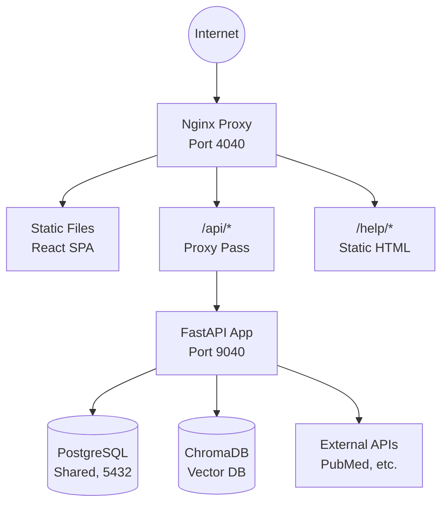
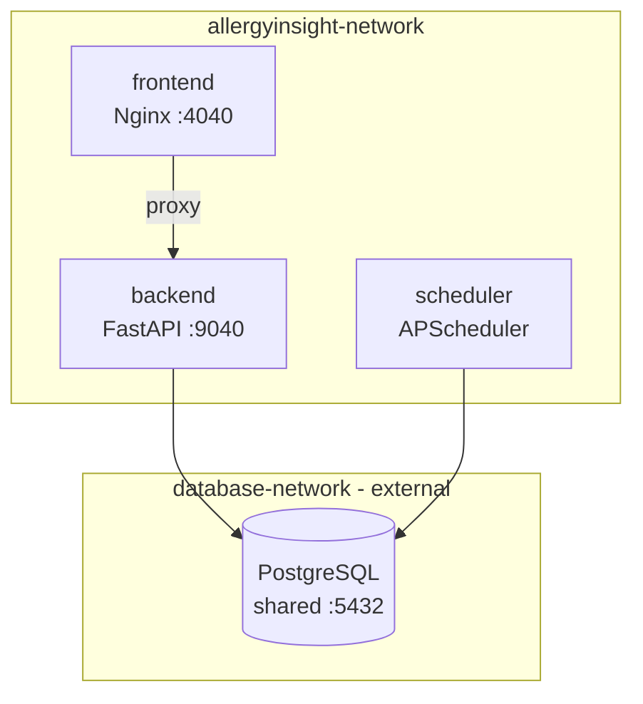
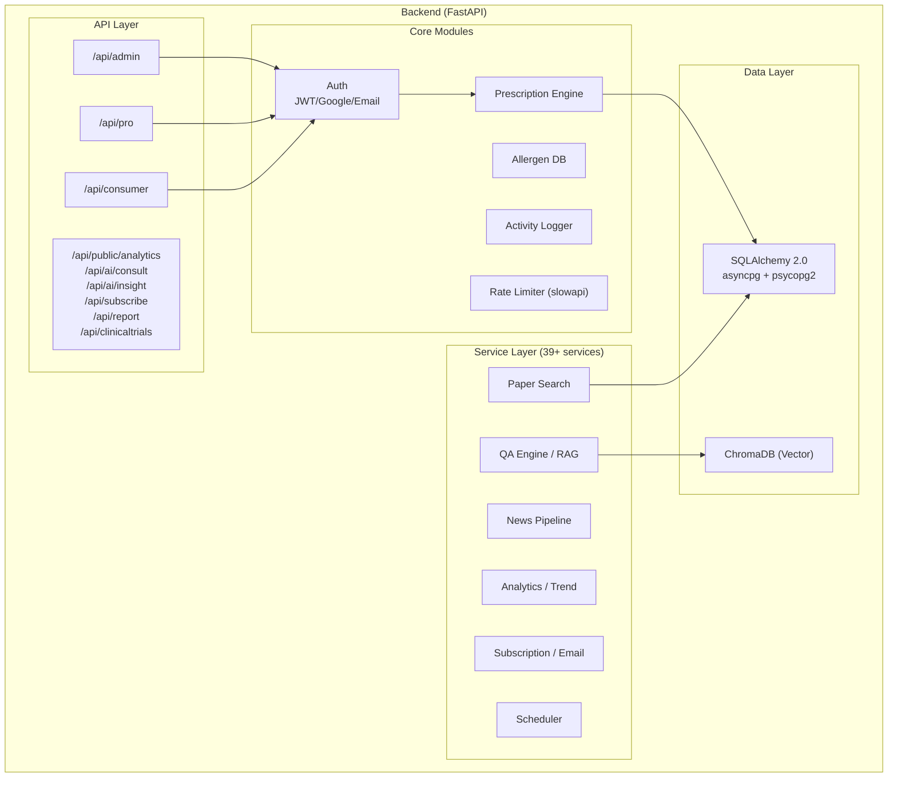
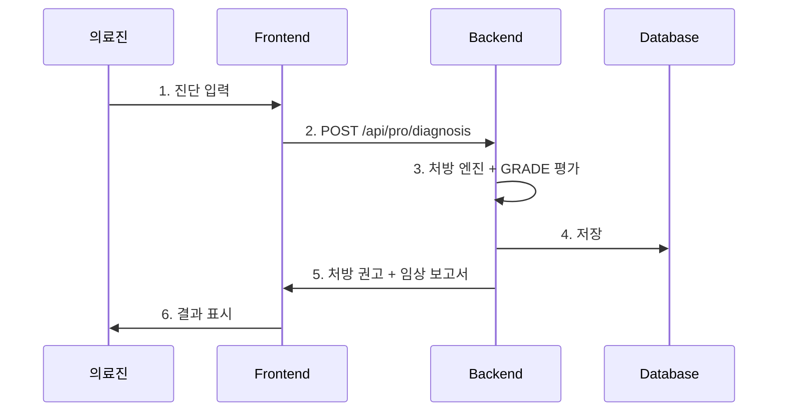
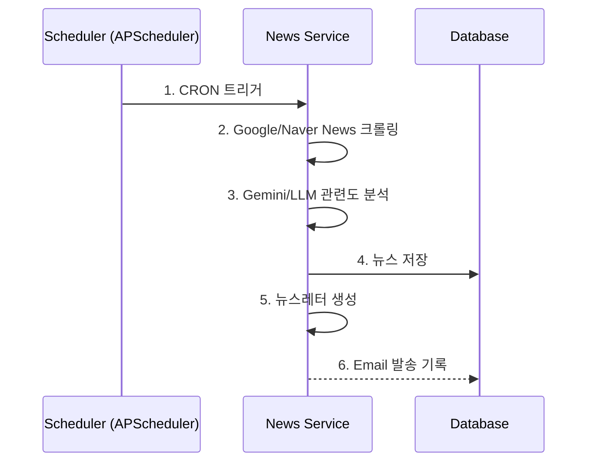
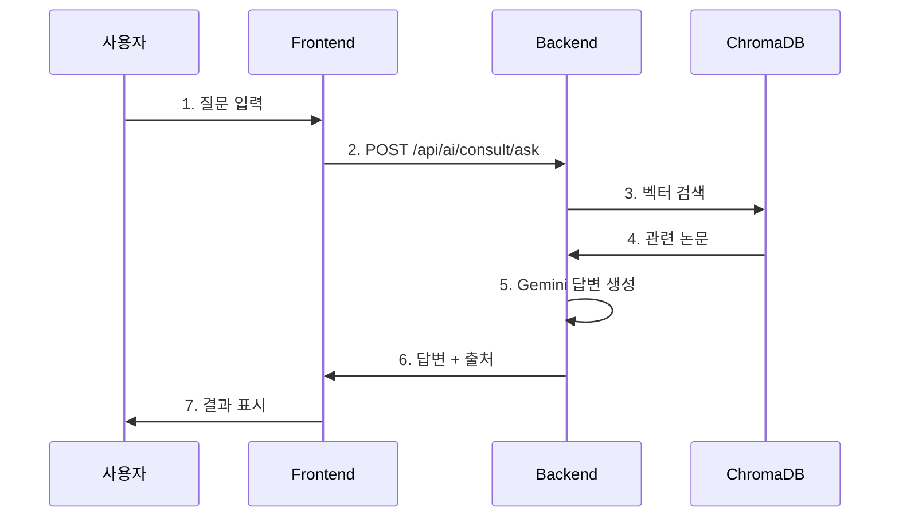
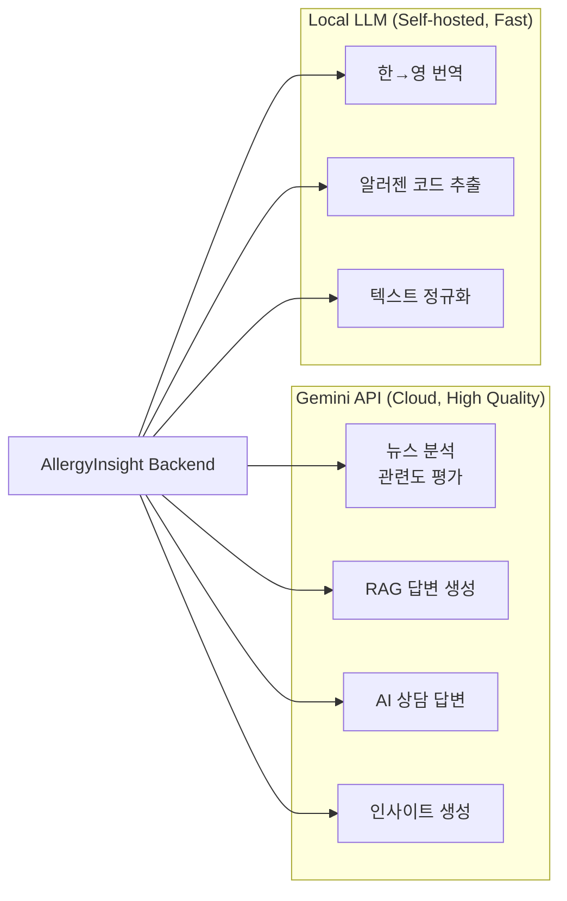
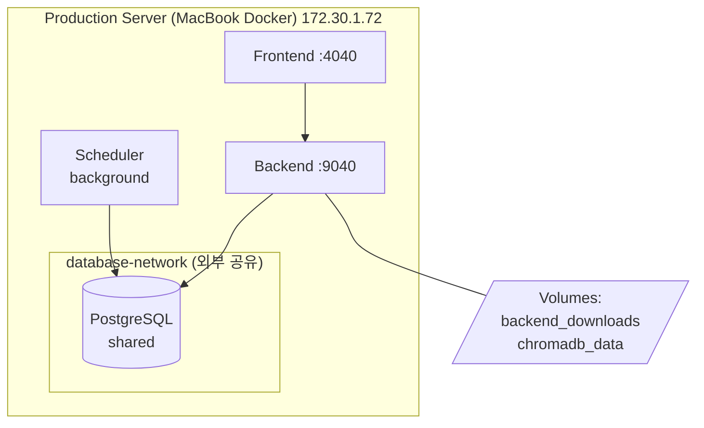
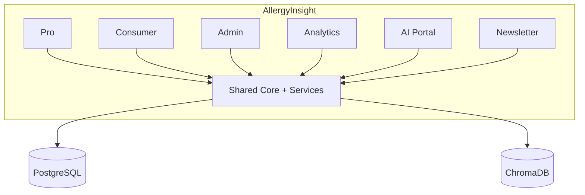

# 2. 아키텍처 (Architecture)

## 2.1 시스템 아키텍처 다이어그램

### 전체 시스템 구조



### 컨테이너 구성



!!! note "주요 특징"
    - PostgreSQL은 `database-network`를 통해 공유 (외부 컨테이너)
    - 내부 통신은 `allergyinsight-network` (bridge)
    - ChromaDB는 backend 볼륨에 내장 (`chromadb_data`)
    - Scheduler는 별도 컨테이너로 분리 (backend 이미지 재사용)

---

## 2.2 서비스 구조 (4-App Architecture)

### 프론트엔드 앱 구조

```
┌─────────────────────────────────────────────────────────────────┐
│                         Frontend (React)                         │
├──────────┬──────────┬──────────┬────────────────────────────────┤
│  Admin   │Profession│ Consumer │     Public Apps                │
│ /admin/* │ /pro/*   │ /app/*   │ /analytics/* /ai/* /subscribe  │
├──────────┼──────────┼──────────┼────────────────────────────────┤
│Dashboard │Dashboard │MyDiagnosis│AllergenAnalysis               │
│Users     │Diagnosis │FoodGuide │PaperCollection                │
│Allergens │Patients  │Lifestyle │AllergenNews                   │
│Papers    │Search/QA │Emergency │ComprehensiveTrend             │
│Orgs      │Papers    │KitRegister│AIConsult / AIInsight         │
│News      │Clinical  │          │Subscribe / Report             │
│Subscribers│Report   │          │ClinicalTrials                 │
│Analytics │          │          │                                │
├──────────┴──────────┴──────────┴────────────────────────────────┤
│                      Shared Components                           │
│        (AuthContext, apiClient, Header, Modal, hooks)            │
└─────────────────────────────────────────────────────────────────┘
```

### 백엔드 API 구조



### 라우팅 구조

| URL 패턴 | 대상 서비스 | 접근 권한 |
|----------|------------|----------|
| `/login` | Public | 모두 |
| `/admin/login` | Admin Login | 모두 |
| `/auth/callback` | OAuth Callback | 모두 |
| `/admin/*` | Admin Console | super_admin |
| `/pro/*` | Professional App | doctor, nurse, lab_tech, hospital_admin |
| `/app/*` | Consumer App | 인증된 사용자 |
| `/analytics/*` | Analytics Dashboard | 모두 (공개) |
| `/ai/consult` | AI 상담 | 모두 (공개) |
| `/ai/insight` | AI 인사이트 | 모두 (공개) |
| `/subscribe` | 뉴스레터 구독 | 모두 (공개) |
| `/report` | 알러지 리포트 | 모두 (공개) |

---

## 2.3 데이터 흐름도 (Data Flow)

### 진단 → 처방 → 임상 보고서 흐름



### 뉴스 파이프라인 흐름



### RAG 기반 AI 상담 흐름



---

## 2.4 기술 스택 (Tech Stack)

=== "Backend"

    | 계층 | 기술 | 버전 | 용도 | 선택 이유 |
    |------|------|------|------|----------|
    | **Runtime** | Python | 3.10+ | 서버 런타임 | 생산성, AI/ML 생태계 |
    | **Framework** | FastAPI | 0.115 | Web API | 비동기, 타입 힌트, 자동 문서화 |
    | **ORM** | SQLAlchemy | 2.0 | DB 접근 | 유연성, 성숙도 |
    | **Validation** | Pydantic | 2.9 | 데이터 검증 | FastAPI 통합 |
    | **Auth** | PyJWT | 2.9 | JWT 토큰 | 표준, 간편함 |
    | **Auth** | google-auth | 2.0+ | Google OAuth | ID 토큰 검증 |
    | **HTTP** | HTTPX | 0.27 | 외부 API 호출 | 비동기 지원 |
    | **Vector DB** | ChromaDB | 0.5+ | RAG 임베딩 검색 | 경량, 내장 가능 |
    | **AI** | OpenAI | 1.12 | GPT API | 텍스트 분석 |
    | **AI** | Gemini API | - | 뉴스 분석, RAG 답변 | 비용 효율 |
    | **AI** | Local LLM | - | 번역, 알러젠 추출 | 비용 절감, 프라이버시 |
    | **Scheduler** | APScheduler | 3.10+ | 주기적 작업 | Python 네이티브 |
    | **Email** | aiosmtplib | 3.0+ | 뉴스레터 발송 | 비동기 이메일 |
    | **Template** | Jinja2 | 3.1+ | 이메일 템플릿 | 표준 |
    | **Rate Limit** | slowapi | 0.1.9 | API 제한 | FastAPI 통합 |
    | **PDF** | PyMuPDF | 1.23 | PDF 파싱 | 속도, 품질 |

=== "Frontend"

    | 계층 | 기술 | 버전 | 용도 | 선택 이유 |
    |------|------|------|------|----------|
    | **Framework** | React | 18 | UI 라이브러리 | 생태계, 컴포넌트 기반 |
    | **Build** | Vite | 5 | 번들러 | 빌드 속도, HMR |
    | **Routing** | React Router | 6 | 클라이언트 라우팅 | 표준 |
    | **HTTP** | Axios | 1.6+ | API 통신 | 인터셉터, 에러 처리 |
    | **Charts** | Recharts | 2.10 | 차트/시각화 | React 네이티브 |
    | **State** | Context API | - | 전역 상태 | 단순함, 내장 |

=== "Database"

    | 기술 | 버전 | 용도 | 선택 이유 |
    |------|------|------|----------|
    | PostgreSQL | 15+ | 주 데이터베이스 | ACID, JSON 지원, 확장성 |
    | ChromaDB | 0.5+ | 벡터 DB (RAG) | 내장 가능, Python 네이티브 |

=== "Infrastructure"

    | 기술 | 용도 | 비고 |
    |------|------|------|
    | Docker Compose | 컨테이너 오케스트레이션 | 3 서비스 (frontend, backend, scheduler) |
    | Nginx | 리버스 프록시 + SPA | 타임아웃/버퍼링 최적화 |
    | GitHub Actions | CI/CD | Self-hosted Runner (macOS) |

---

## 2.5 LLM 이중 아키텍처

### 구성



### 환경 변수

| 변수 | 설명 | 기본값 |
|------|------|--------|
| `GEMINI_API_KEY` | Gemini API 키 | - |
| `NEWS_LLM_PROVIDER` | 뉴스 분석 제공자 | `gemini` |
| `RAG_LLM_PROVIDER` | RAG 답변 제공자 | `gemini` |
| `LLM_API_URL` | Local LLM 엔드포인트 | `http://host.docker.internal:11435/v1` |
| `LLM_MODEL` | Local LLM 모델명 | `mlx-community/EXAONE-3.5-7.8B-Instruct-4bit` |

!!! warning "환경 변수 보안"
    API 키와 엔드포인트 정보는 `.env` 파일에만 저장하고, 소스코드에 하드코딩하지 마세요.

---

## 2.6 인프라 구성

### 운영 환경



### 네트워크 구성

| 네트워크 | 타입 | 용도 |
|----------|------|------|
| `database-network` | external | PostgreSQL 공유 (다른 서비스와 공유) |
| `allergyinsight-network` | bridge | 내부 서비스 간 통신 |

---

## 2.7 보안 아키텍처

### 인증 방식

| 방식 | 용도 | 엔드포인트 |
|------|------|----------|
| **Google OAuth** | 소셜 로그인 (ID 토큰) | `/api/auth/google/verify` |
| **Simple Auth** | 간편 로그인 (이름 + PIN) | `/api/auth/simple/login` |
| **Email Auth** | 이메일 + 비밀번호 로그인 | `/api/auth/email/login` |
| **Admin Auth** | 관리자 전용 로그인 | `/api/auth/admin/login` |
| **JWT Token** | API 인증 | `Authorization: Bearer <token>` |

### 인가 (Authorization)

| 역할 | Professional | Consumer | Admin | Public APIs |
|------|-------------|----------|-------|-------------|
| 비인증 | :x: | :x: | :x: | :white_check_mark: |
| patient | :x: | :white_check_mark: | :x: | :white_check_mark: |
| doctor | :white_check_mark: | :white_check_mark: | :x: | :white_check_mark: |
| nurse | :white_check_mark: | :white_check_mark: | :x: | :white_check_mark: |
| lab_tech | :white_check_mark: (제한적) | :white_check_mark: | :x: | :white_check_mark: |
| hospital_admin | :white_check_mark: | :white_check_mark: | :white_check_mark: (병원) | :white_check_mark: |
| admin | :white_check_mark: | :white_check_mark: | :white_check_mark: | :white_check_mark: |
| super_admin | :white_check_mark: | :white_check_mark: | :white_check_mark: | :white_check_mark: |

### 보안 기능

| 기능 | 구현 |
|------|------|
| Rate Limiting | slowapi (60/min 기본, API별 개별 설정) |
| CORS | 허용 Origin 명시 (allow_origins=["*"] 금지) |
| PII Masking | 활동 로그에서 개인정보 마스킹 |
| Activity Logging | 미들웨어 기반 사용자 행동 추적 |
| JWT Expiry | 1440분 (24시간) |

---

## 2.8 확장성 고려사항

### 현재 (Modular Monolith)



### Scheduler 분리 패턴

!!! tip "Scheduler 분리 전략"
    - backend와 동일한 이미지를 사용하되, `command` 오버라이드로 스케줄러 모드 실행
    - API 서버의 부하와 스케줄러 작업을 분리
    - 독립적인 restart 정책

---

[← 프로젝트 개요](project-overview.md) | [다음: 도메인 모델 →](domain-model.md)
