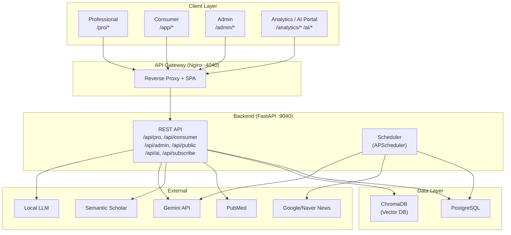

# AllergyInsight

<div style="text-align: center; margin-bottom: 1em;">
  <span class="md-badge md-badge--primary">v3.0.0</span>
  <span class="md-badge md-badge--success">Active</span>
  <span class="md-badge md-badge--info">MIT License</span>
</div>

> **SGTi-Allergy Screen PLUS 기반 알러지 진단 및 처방 권고 시스템**

AllergyInsight는 알러지 검사 결과를 분석하여 의료진에게는 근거 기반 처방 권고를, 환자에게는 맞춤형 생활 가이드를 제공하는 통합 헬스케어 플랫폼입니다. AI 기반 논문 분석, 알러젠 트렌드 대시보드, 뉴스레터 시스템을 포함합니다.

---

## 핵심 기능

=== "Professional (의료진)"

    | 기능 | 설명 |
    |------|------|
    | **진단 입력** | SGTi-Allergy Screen PLUS 검사 결과 입력 및 관리 |
    | **처방 권고** | 알러젠별 회피 식품, 대체 식품, 주의사항 자동 생성 |
    | **임상 보고서** | GRADE 근거 기반 SOAP Note 형식 보고서, ICD-10 코드 |
    | **환자 관리** | 환자 등록, 진단 이력 관리, 동의서 처리 |
    | **논문 검색** | PubMed/Semantic Scholar/Europe PMC/OpenAlex 통합 검색 |
    | **Q&A 시스템** | 논문 기반 질의응답 (RAG) |

=== "Consumer (환자)"

    | 기능 | 설명 |
    |------|------|
    | **내 진단 결과** | 검사 결과 조회 및 상세 분석 |
    | **식품 가이드** | 회피/대체 식품, 교차반응 정보 |
    | **응급 대처** | 아나필락시스 대응, 에피펜 사용법 |
    | **생활 관리** | 알러젠별 일상 관리 팁 |
    | **키트 등록** | 검사 키트 시리얼/PIN 등록 |

=== "Admin (관리자)"

    | 기능 | 설명 |
    |------|------|
    | **사용자 관리** | 사용자 목록, 역할 변경, 통계 |
    | **알러젠 관리** | 알러젠 마스터 데이터 CRUD |
    | **논문 관리** | 논문 수집 현황, 알러젠 링크 |
    | **구독자 관리** | 뉴스레터 구독자 관리, 통계 |
    | **분석 관리** | 트렌드 집계, 키워드/치료법/역학 추출 |

=== "Analytics & AI (공개)"

    | 기능 | 설명 |
    |------|------|
    | **트렌드 대시보드** | 논문+뉴스+치료법+역학 종합 트렌드 |
    | **AI 상담** | RAG 기반 알러지 질의응답 |
    | **AI 인사이트** | 알러젠별 분석 보고서, 트렌드 |
    | **임상시험 검색** | ClinicalTrials.gov 연동 |
    | **뉴스레터** | 이메일 인증 기반 구독/자동 발송 |

---

## 시스템 구조



---

## 기술 스택

### Backend

| 기술 | 버전 | 용도 |
|------|------|------|
| Python | 3.10+ | 런타임 |
| FastAPI | 0.115 | Web Framework |
| SQLAlchemy | 2.0 | ORM (asyncpg + psycopg2) |
| PostgreSQL | 15+ | Database |
| ChromaDB | 0.5+ | Vector DB (RAG) |
| APScheduler | 3.10+ | 뉴스/뉴스레터 스케줄러 |
| Gemini API | — | 뉴스 분석, RAG 답변 |
| Local LLM | — | 번역, 알러젠 추출 |

### Frontend

| 기술 | 버전 | 용도 |
|------|------|------|
| React | 18 | UI Framework |
| Vite | 5 | Build Tool |
| React Router | 6 | Routing |
| Recharts | 2.10 | 차트/시각화 |

### Infrastructure

| 기술 | 용도 |
|------|------|
| Docker Compose | 3-서비스 오케스트레이션 |
| Nginx | 리버스 프록시 + SPA + Wiki |
| GitHub Actions | CI/CD (Self-hosted Runner) |

---

## 빠른 시작

```bash
# 1. 저장소 클론
git clone https://github.com/bluevlad/AllergyInsight.git
cd AllergyInsight

# 2. 환경 변수 설정
cp .env.example .env

# 3. 서비스 시작
docker compose up -d

# 4. 접속
# Frontend: http://localhost:4040
# Wiki: http://localhost:4040/wiki/
# API Docs: http://localhost:9040/docs
```

---

## 개발 현황

### 알러젠 트렌드 분석

| Phase | 내용 | 상태 |
|-------|------|------|
| Phase 1 | 논문 기반 알러젠 언급률 트렌드 분석 | :white_check_mark: 완료 |
| Phase 2 | 치료법 엔티티 추출 및 트렌드 분석 | :white_check_mark: 완료 |
| Phase 3 | 뉴스 기반 알러젠 트렌드 + 종합 통합 API | :white_check_mark: 완료 |
| Phase 4 | 역학 데이터 추출 (유병률/발병률/환자수) | :white_check_mark: 완료 |
| Phase 5 | 알러젠 종합 트렌드 대시보드 | :white_check_mark: 완료 |

---

## 프로젝트 구조

```
AllergyInsight/
├── backend/
│   └── app/
│       ├── api/              # FastAPI 라우터 + Public API
│       ├── auth/             # 인증 (JWT, Google OAuth, Email)
│       ├── admin/            # 관리자 콘솔 API
│       ├── core/             # 공통 모듈 (Auth, Allergen)
│       ├── professional/     # 의료진 서비스
│       ├── consumer/         # 환자 서비스
│       ├── scheduler/        # 뉴스/뉴스레터 스케줄러
│       ├── database/         # DB 모델, 시드, 마이그레이션
│       └── services/         # 비즈니스 로직 (39+ 서비스)
├── frontend/
│   └── src/
│       ├── apps/
│       │   ├── admin/        # 관리자 콘솔
│       │   ├── analytics/    # 트렌드 분석 (공개)
│       │   ├── professional/ # 의료진 앱
│       │   └── consumer/     # 환자 앱
│       └── pages/            # 공개 페이지
├── wiki/                     # MkDocs 위키 (이 사이트)
├── e2e/                      # E2E 테스트
└── docker-compose.yml
```
