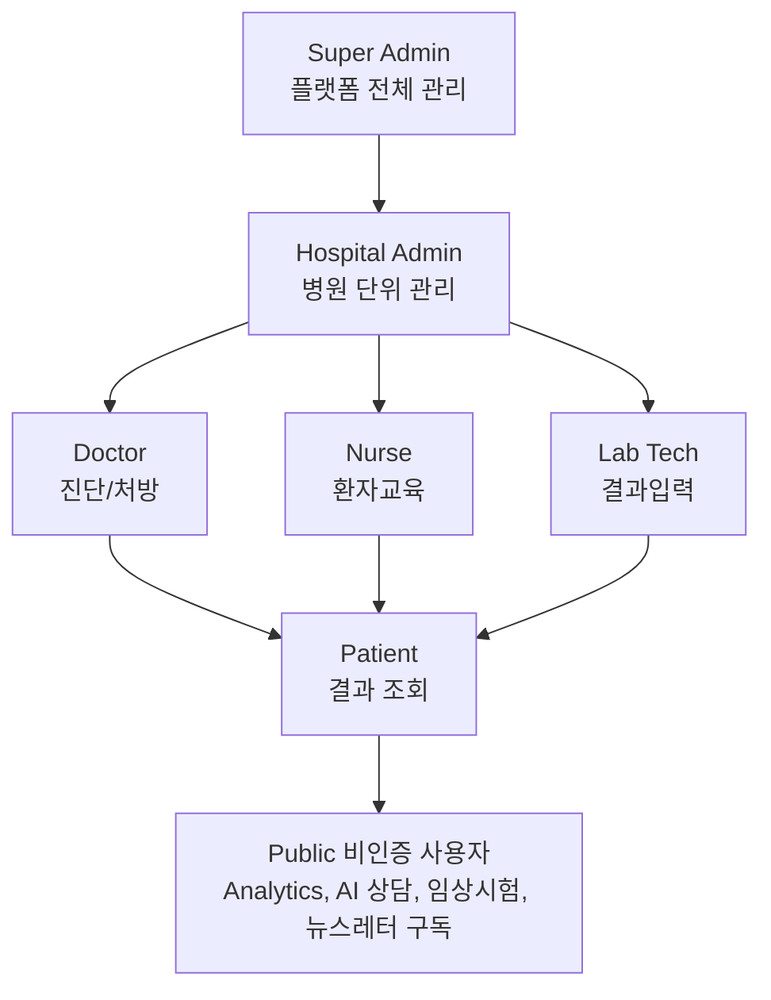

# 1. 프로젝트 개요 (Project Overview)

## 1.1 프로젝트 소개

### 프로젝트 정보

| 항목 | 내용 |
|------|------|
| **프로젝트명** | AllergyInsight |
| **버전** | 3.0.0 |
| **시작일** | 2024년 |
| **상태** | Active Development |
| **라이선스** | MIT |

### 한줄 요약

!!! tip "AllergyInsight"
    SGTi-Allergy Screen PLUS 검사 결과를 기반으로 의료진에게는 근거 기반 처방 권고를, 환자에게는 맞춤형 생활 가이드를 제공하며, AI 기반 트렌드 분석과 뉴스레터를 통해 알러지 정보를 종합적으로 전달하는 통합 헬스케어 플랫폼

### 상세 설명

AllergyInsight는 알러지 검사 결과 데이터를 활용하여 다음과 같은 가치를 제공합니다:

1. **의료진 지원**: 16종 알러젠에 대한 검사 결과를 분석하여 과학적 근거에 기반한 처방 권고 및 GRADE 기반 임상 보고서 생성
2. **환자 교육**: 복잡한 의학 정보를 이해하기 쉬운 형태로 변환하여 환자 스스로 관리할 수 있도록 지원
3. **연구 지원**: 최신 논문 검색, RAG 기반 Q&A, AI 상담을 통한 의료진 및 일반인의 정보 접근성 향상
4. **트렌드 분석**: 논문/뉴스/치료법/역학 데이터를 종합한 알러젠 트렌드 대시보드 제공
5. **정보 전달**: 맞춤형 뉴스레터를 통한 알러지 관련 최신 뉴스 및 연구 동향 발송

---

## 1.2 비전 및 목표

### 비전 (Vision)

!!! note "Vision"
    "모든 알러지 환자가 자신의 상태를 정확히 이해하고,
    적절한 관리를 통해 건강한 삶을 영위할 수 있도록 돕는다"

### 미션 (Mission)

- 알러지 검사 결과의 **정확한 해석** 제공
- **근거 기반** 처방 권고 시스템 구축
- 환자 **자기 관리** 역량 강화
- 의료진과 환자 간 **정보 격차** 해소
- AI를 활용한 **트렌드 분석**과 **정보 접근성** 향상

### 핵심 목표

| 목표 | 측정 지표 | 목표치 |
|------|----------|--------|
| 처방 정확도 향상 | 처방 권고 채택률 | 80%+ |
| 환자 이해도 개선 | 가이드 만족도 | 4.5/5.0 |
| 의료진 업무 효율화 | 진단 소요 시간 | 50% 감소 |
| 연구 접근성 향상 | 논문 검색 활용률 | 월 100회+ |
| 정보 전달 | 뉴스레터 구독자 수 | 월간 증가 |

---

## 1.3 핵심 가치 제안 (Value Proposition)

### 의료진 (Professional)

=== "Before"

    - 16종 알러젠별 처방 기준 암기 필요
    - 교차반응, 숨겨진 알러젠 정보 수기 확인
    - 최신 연구 동향 파악에 많은 시간 소요
    - 환자 설명 자료 별도 준비 필요

=== "After (AllergyInsight)"

    - :white_check_mark: 검사 결과 입력 → 자동 처방 권고 생성
    - :white_check_mark: GRADE 근거 기반 임상 보고서 + ICD-10 코드 자동 생성
    - :white_check_mark: 알러젠별 교차반응, 숨겨진 식품 자동 표시
    - :white_check_mark: 논문 검색 & RAG Q&A로 신속한 정보 획득
    - :white_check_mark: 환자용 가이드 자동 생성 및 제공
    - :white_check_mark: 알러젠 트렌드 대시보드로 최신 동향 파악

### 환자 (Consumer)

=== "Before"

    - 검사 결과지 해석 어려움
    - 어떤 음식을 피해야 하는지 불명확
    - 응급 상황 대처법 모름
    - 일상 관리 방법 정보 부족

=== "After (AllergyInsight)"

    - :white_check_mark: 내 알러지 등급 시각적으로 명확히 확인
    - :white_check_mark: 회피 식품 / 대체 식품 목록 제공
    - :white_check_mark: 응급 대처 가이드 & 에피펜 사용법
    - :white_check_mark: 계절별, 상황별 생활 관리 팁
    - :white_check_mark: AI 상담을 통한 알러지 관련 질의응답
    - :white_check_mark: 맞춤형 뉴스레터로 최신 정보 수신

---

## 1.4 이해관계자 (Stakeholders)

### 사용자 유형

| 유형 | 역할 | 주요 니즈 | 제공 기능 |
|------|------|----------|----------|
| **의사** | 진단/처방 | 정확한 처방 권고 | 진단 입력, 처방 생성, 임상 보고서, 환자 관리 |
| **간호사** | 환자 교육 | 설명 자료 | 환자 가이드, 응급 대처 |
| **검사실** | 결과 입력 | 효율적 입력 | 키트 관리, 결과 입력 |
| **병원 관리자** | 통계/운영 | 현황 파악 | 대시보드, 통계 |
| **환자** | 결과 조회 | 이해하기 쉬운 정보 | 진단 조회, 식품 가이드, 응급 대처, AI 상담 |
| **보호자** | 관리 지원 | 관리 정보 | 생활 가이드, 응급 대처 |
| **일반 사용자** | 정보 탐색 | 알러지 트렌드 | Analytics 대시보드, AI 인사이트, 임상시험 검색 |
| **플랫폼 관리자** | 운영 관리 | 플랫폼 통제 | Admin 콘솔, 사용자/데이터/분석 관리 |

### 역할 기반 접근 권한

---

## 1.5 주요 기능 요약

### Professional Service (/pro/*)

| 카테고리 | 기능 | 설명 | 상태 |
|----------|------|------|------|
| **진단** | 진단 입력 | 16종 알러젠 등급(0-6) 입력 | :white_check_mark: |
| | 처방 생성 | 등급별 맞춤 처방 권고 자동 생성 | :white_check_mark: |
| | 임상 보고서 | GRADE 기반 SOAP Note, ICD-10 코드 | :white_check_mark: |
| | 진단 이력 | 환자별 과거 진단 기록 조회 | :white_check_mark: |
| **환자** | 환자 등록 | 신규 환자 등록 및 동의서 | :white_check_mark: |
| | 환자 검색 | 이름/전화번호로 환자 검색 | :white_check_mark: |
| | 환자 상세 | 환자 정보 및 진단 이력 조회 | :white_check_mark: |
| **연구** | 논문 검색 | PubMed/Semantic Scholar/Europe PMC/OpenAlex 통합 검색 | :white_check_mark: |
| | Q&A | 논문 기반 질의응답 (RAG) | :white_check_mark: |
| | 논문 관리 | 논문 등록/수정/삭제 | :white_check_mark: |
| **대시보드** | 통계 | 진단 현황, 알러젠 분포 등 | :white_check_mark: |

### Consumer Service (/app/*)

| 카테고리 | 기능 | 설명 | 상태 |
|----------|------|------|------|
| **진단** | 결과 조회 | 내 진단 결과 목록 및 상세 | :white_check_mark: |
| | 상세 분석 | 알러젠별 등급, 증상, 관리법 | :white_check_mark: |
| **가이드** | 식품 가이드 | 회피/대체/교차반응 식품 | :white_check_mark: |
| | 생활 관리 | 계절별, 상황별 관리 팁 | :white_check_mark: |
| | 응급 대처 | 증상별 대응, 에피펜 사용법 | :white_check_mark: |
| **등록** | 키트 등록 | 시리얼/PIN으로 결과 연결 | :white_check_mark: |

### Admin Console (/admin/*)

| 카테고리 | 기능 | 설명 | 상태 |
|----------|------|------|------|
| **사용자** | 사용자 관리 | 목록, 상세, 역할 변경, 통계 | :white_check_mark: |
| **데이터** | 알러젠 관리 | 마스터 데이터 CRUD, 복원 | :white_check_mark: |
| | 논문 관리 | 수집 현황, 알러젠 링크 | :white_check_mark: |
| | 조직 관리 | 병원/클리닉 승인/거절 | :white_check_mark: |
| **뉴스** | 뉴스 관리 | 경쟁사/업계 뉴스 수집, 수정 | :white_check_mark: |
| | 구독자 관리 | 뉴스레터 구독자 목록, 통계 | :white_check_mark: |
| **분석** | 트렌드 집계 | 월간 논문/뉴스 트렌드 집계 | :white_check_mark: |
| | 키워드 추출 | 논문 키워드 자동 추출 | :white_check_mark: |
| | 치료법 추출 | 치료법 엔티티 추출 | :white_check_mark: |
| | 역학 추출 | 유병률/발병률/환자수 추출 | :white_check_mark: |
| | 활동 통계 | 사용자 활동 로그 분석 | :white_check_mark: |

### Analytics Dashboard (/analytics/*)

| 기능 | 설명 | 상태 |
|------|------|------|
| 알러젠 분석 | 알러젠별 논문/뉴스 트렌드 차트 | :white_check_mark: |
| 논문 수집 현황 | 출처별 수집 통계 | :white_check_mark: |
| 알러젠 뉴스 | 뉴스 기반 알러젠 동향 | :white_check_mark: |
| 종합 트렌드 | 논문+뉴스+치료법+역학 통합 뷰 | :white_check_mark: |

### AI Portal (/ai/*)

| 기능 | 설명 | 상태 |
|------|------|------|
| AI 상담 | RAG 기반 알러지 Q&A (공개) | :white_check_mark: |
| AI 인사이트 | 알러젠별 종합 분석, 트렌드, 뉴스 | :white_check_mark: |
| 임상시험 검색 | ClinicalTrials.gov 검색 | :white_check_mark: |

### Newsletter System

| 기능 | 설명 | 상태 |
|------|------|------|
| 이메일 구독 | 인증 코드 기반 구독 | :white_check_mark: |
| 키워드 맞춤 | 관심 알러젠/키워드 설정 | :white_check_mark: |
| 자동 발송 | 스케줄러 기반 자동 뉴스레터 | :white_check_mark: |
| 구독 관리 | 상태 확인, 키워드 변경, 해지 | :white_check_mark: |

---

## 1.6 기술적 특징

### 핵심 기술

| 기술 | 적용 영역 | 효과 |
|------|----------|------|
| **지식 베이스** | 알러젠 DB | 16종 알러젠별 상세 정보 (증상, 식품, 교차반응) |
| **등급 시스템** | 처방 엔진 | 0-6 등급별 차등화된 권고 생성 |
| **RAG** | Q&A 시스템 | ChromaDB 벡터 검색 + LLM 기반 신뢰성 있는 답변 생성 |
| **RBAC** | 인증/인가 | 역할 기반 세분화된 접근 제어 |
| **GRADE** | 임상 보고서 | 근거 수준 기반 임상 진술문 및 권고 |
| **Dual LLM** | AI 분석 | Gemini (뉴스/RAG) + Local LLM (번역/추출) 이중 구조 |
| **트렌드 분석** | Analytics | 논문/뉴스/치료법/역학 종합 트렌드 |

### 데이터 출처

- SGTi-Allergy Screen PLUS 공식 매뉴얼
- 대한천식알레르기학회 가이드라인
- PubMed / Semantic Scholar / Europe PMC / OpenAlex / bioRxiv / CORE
- Google News / Naver News (알러지 관련)
- ClinicalTrials.gov

---

## 1.7 프로젝트 범위

=== "In Scope (포함)"

    - 알러지 검사 결과 입력 및 관리
    - 처방 권고 자동 생성 및 임상 보고서
    - 환자 교육 자료 제공
    - 논문 검색 및 Q&A (RAG)
    - 병원 단위 환자 관리
    - AI 기반 알러지 상담
    - 알러젠 트렌드 분석 대시보드
    - 뉴스레터 구독/발송 시스템
    - 임상시험 정보 검색
    - 플랫폼 관리자 콘솔

=== "Out of Scope (미포함)"

    !!! warning "다음 기능은 현재 범위에 포함되지 않습니다"
        - 실제 의료 행위 (진단, 처방)
        - 보험 청구 시스템 연동
        - 전자의무기록(EMR) 통합
        - 실시간 환자 모니터링
        - 약물 상호작용 검사

---

## 1.8 성공 기준

### 정량적 지표

| 지표 | 현재 | 목표 | 측정 방법 |
|------|------|------|----------|
| 월간 활성 사용자 (MAU) | - | 500+ | 로그인 집계 |
| 월간 진단 입력 건수 | - | 1,000+ | DB 집계 |
| 처방 권고 생성률 | - | 95%+ | 진단 대비 처방 비율 |
| 시스템 가용성 | - | 99.5%+ | 업타임 모니터링 |
| 뉴스레터 구독자 수 | - | 1,000+ | 구독자 DB 집계 |
| AI 상담 이용률 | - | 월 500회+ | API 호출 집계 |

### 정성적 지표

- 의료진 업무 만족도 향상
- 환자 자기 관리 역량 강화
- 알러지 관련 정보 접근성 개선
- 트렌드 분석을 통한 연구 인사이트 제공

---

[Home](index.md) | [다음: 아키텍처 →](architecture.md)
