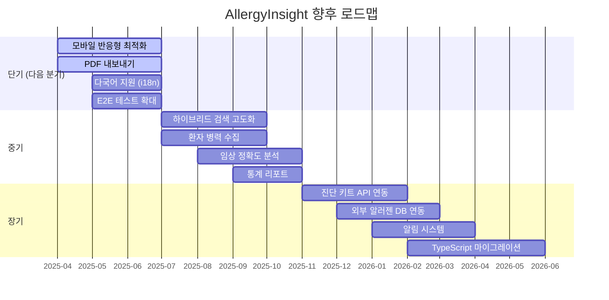
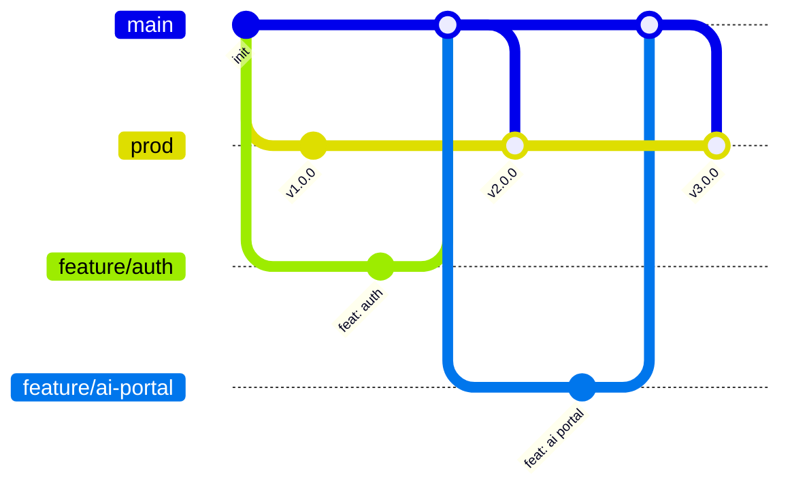

# 로드맵 (Roadmap)

## 릴리스 히스토리

=== "v3.0.0 (Current)"

    !!! success "v3.0.0 — AI 포털 + 트렌드 분석 + 뉴스레터 + Admin 콘솔"

        #### Added
        - AI 상담 포털 (`/ai/consult`) — RAG 기반 공개 Q&A
        - AI 인사이트 포털 (`/ai/insight`) — 알러젠 분석, 뉴스, 트렌드
        - 임상시험 검색 (`/api/clinicaltrials`) — ClinicalTrials.gov 연동
        - 알러젠 트렌드 분석 대시보드 (Phase 1-5)
            - 논문 기반 알러젠 언급률 트렌드
            - 치료법 엔티티 추출 및 트렌드
            - 뉴스 기반 알러젠 트렌드
            - 역학 데이터 추출 (유병률/발병률/환자수)
            - 종합 트렌드 대시보드 (Frontend)
        - Admin 콘솔 (`/admin/*`) — 사용자/데이터/분석 관리
        - 뉴스레터 구독/발송 시스템
        - 뉴스 파이프라인 (Google News / Naver News)
        - Scheduler 컨테이너 분리
        - LLM 이중 아키텍처 (Gemini + Local LLM)
        - 활동 로깅 미들웨어
        - 이메일 인증 로그인
        - 알러지 리포트 생성 (공개, stateless)
        - Nginx 프록시 타임아웃/버퍼링 최적화
        - 헬프 페이지 (ai-consult-guide, analytics-guide)

        #### Changed
        - Frontend 4-App 구조 (Admin, Professional, Consumer, Analytics)
        - 환경 변수 체계 확장 (LLM, News, Email, Scheduler)
        - Docker Compose 3-서비스 구조 (backend, frontend, scheduler)

    #### 주요 변경사항

    - AI 상담 포털 (RAG 기반 Q&A, 공개)
    - AI 인사이트 포털 (알러젠 분석, 뉴스, 트렌드)
    - 임상시험 검색 (ClinicalTrials.gov 연동)
    - 알러젠 트렌드 분석 대시보드 (Phase 1-5 완료)
    - 뉴스레터 구독/발송 시스템
    - Admin 콘솔 (사용자/데이터/분석 관리)
    - 뉴스 파이프라인 (Google News / Naver News)
    - LLM 이중 아키텍처 (Gemini + Local LLM)
    - Scheduler 컨테이너 분리
    - 활동 로깅 미들웨어
    - 이메일 인증 로그인 추가
    - Nginx 프록시 최적화

    #### 알러젠 트렌드 분석 Phase 완료 현황

    | Phase | 내용 | 완료일 |
    |-------|------|--------|
    | Phase 1 | :white_check_mark: 논문 기반 알러젠 언급률 트렌드 분석 | 2025-03 |
    | Phase 2 | :white_check_mark: 치료법 엔티티 추출 및 트렌드 분석 | 2025-03 |
    | Phase 3 | :white_check_mark: 뉴스 기반 알러젠 트렌드 + 종합 통합 API | 2025-03 |
    | Phase 4 | :white_check_mark: 역학 데이터 추출 (유병률/발병률/환자수) | 2025-03 |
    | Phase 5 | :white_check_mark: 알러젠 종합 트렌드 대시보드 (Frontend) | 2025-03 |

=== "v2.0.0"

    !!! success "v2.0.0 — 서비스 이원화 + 임상 보고서"

        #### Added
        - 서비스 이원화 (Professional / Consumer)
        - GRADE 근거 기반 임상 보고서
        - 임상 진술문 시스템
        - URL 기반 라우팅 시스템
        - Consumer 전용 API 엔드포인트
        - 다중 논문 소스 통합

        #### Changed
        - API prefix 분리 (/api/pro/*, /api/consumer/*)
        - 디렉토리 구조 재편 (core/, professional/, consumer/)

    - 서비스 이원화 완료 (Professional / Consumer)
    - URL 기반 라우팅 (`/pro/*`, `/app/*`)
    - API prefix 분리 (`/api/pro/*`, `/api/consumer/*`)
    - GRADE 근거 기반 임상 보고서 (SOAP Note, ICD-10)
    - 임상 진술문 시스템
    - 역할 기반 접근 제어 강화
    - 다중 논문 소스 통합 (PubMed, Semantic Scholar, Europe PMC, OpenAlex, bioRxiv, CORE)

=== "v1.5.0"

    !!! success "v1.5.0 — 병원 서비스 확장"

        #### Added
        - 병원 조직 관리 기능
        - 병원-환자 연결 시스템
        - 의료진 역할 세분화
        - GitHub Actions CI/CD

    - 조직(Organization) 관리 기능
    - 병원-환자 연결 시스템
    - 의료진 역할 세분화 (의사, 간호사, 검사기사)
    - 병원 대시보드
    - GitHub Actions CI/CD

=== "v1.0.0"

    !!! success "v1.0.0 — 초기 릴리스"

        #### Added
        - 초기 릴리스
        - 사용자 인증 (JWT + Google OAuth)
        - 진단 입력 및 조회
        - 처방 권고 생성
        - 알러젠 데이터베이스 (16종)

    - 기본 인증 시스템 (JWT + Google OAuth)
    - 진단 입력 및 조회
    - 처방 권고 생성
    - 알러젠 데이터베이스 (16종)
    - 논문 검색 (PubMed)
    - Q&A 시스템

---

## 현재 기능 현황

### 기능별 상태 총괄

| 구분 | 기능 | 상태 |
|------|------|------|
| **Core** | 인증 시스템 (JWT + Google + Email) | :white_check_mark: |
| | 역할 기반 접근 제어 (RBAC, 7 역할) | :white_check_mark: |
| | 알러젠 지식베이스 (16종) | :white_check_mark: |
| | Rate Limiting (slowapi) | :white_check_mark: |
| | 활동 로깅 미들웨어 | :white_check_mark: |
| **Professional** | 진단 입력/관리 | :white_check_mark: |
| | 처방 권고 자동 생성 | :white_check_mark: |
| | 임상 보고서 (GRADE/ICD-10) | :white_check_mark: |
| | 환자 관리 | :white_check_mark: |
| | 논문 검색 (6개 소스) | :white_check_mark: |
| | Q&A 시스템 (RAG) | :white_check_mark: |
| | 대시보드 | :white_check_mark: |
| **Consumer** | 내 진단 조회 | :white_check_mark: |
| | 식품/생활/응급 가이드 | :white_check_mark: |
| | 키트 등록 | :white_check_mark: |
| **Admin** | 사용자/조직/알러젠/논문 관리 | :white_check_mark: |
| | 구독자/뉴스 관리 | :white_check_mark: |
| | 트렌드 분석 관리 | :white_check_mark: |
| **Analytics** | 알러젠 트렌드 (논문/뉴스/치료법/역학) | :white_check_mark: |
| | 종합 트렌드 대시보드 | :white_check_mark: |
| **AI Portal** | AI 상담 (RAG Q&A) | :white_check_mark: |
| | AI 인사이트 | :white_check_mark: |
| | 임상시험 검색 | :white_check_mark: |
| **Newsletter** | 구독/인증/발송/해지 | :white_check_mark: |
| | 키워드 맞춤 개인화 | :white_check_mark: |
| **Infrastructure** | Docker Compose (3 컨테이너) | :white_check_mark: |
| | GitHub Actions CI/CD | :white_check_mark: |
| | LLM 이중 아키텍처 | :white_check_mark: |

---

## 향후 로드맵

### 타임라인 개요



### 단기 (다음 분기)

| 기능 | 설명 | 우선순위 |
|------|------|----------|
| 모바일 반응형 최적화 | Consumer/Analytics 모바일 UX 개선 | 높음 |
| PDF 내보내기 | 임상 보고서 / 환자 가이드 PDF 생성 | 높음 |
| 다국어 지원 (i18n) | 영어 지원 | 중간 |
| E2E 테스트 확대 | Playwright 테스트 커버리지 확대 | 중간 |

### 중기

| 기능 | 설명 | 우선순위 |
|------|------|----------|
| 하이브리드 검색 고도화 | BM25 + Semantic 검색 엔진 개선 | 중간 |
| 환자 병력 수집 | Pre-Test/Post-Test 설문 시스템 | 중간 |
| 임상 정확도 분석 | 검사-병력 비교 엔진 (CRS) | 중간 |
| 통계 리포트 | 병원별/기간별 통계 내보내기 | 낮음 |

### 장기

| 기능 | 설명 | 우선순위 |
|------|------|----------|
| 진단 키트 API 연동 | 검사 결과 자동 수신 | 낮음 |
| 외부 알러젠 DB 연동 | 글로벌 알러젠 DB | 낮음 |
| 알림 시스템 | 푸시 알림, 앱 내 알림 | 낮음 |
| TypeScript 마이그레이션 | Frontend 타입 안전성 | 낮음 |

---

## 기술 부채

!!! warning "해결 필요"

    | 항목 | 설명 | 영향도 |
    |------|------|--------|
    | 테스트 커버리지 | 단위 테스트 확대 필요 | 높음 |
    | 에러 처리 표준화 | 일관된 에러 응답 형식 | 중간 |
    | 로깅 표준화 | 구조화된 로깅 (JSON) | 중간 |

---

## 버전 관리 정책

### 시맨틱 버저닝

```
MAJOR.MINOR.PATCH

예: 3.0.0
    │ │ └── 버그 수정, 패치
    │ └──── 기능 추가 (하위 호환)
    └────── 대규모 변경 (하위 비호환)
```

### 브랜치 정책



| 브랜치 | 용도 | 배포 환경 |
|--------|------|----------|
| `main` | 안정 버전 | - |
| `prod` | 운영 배포 | Production (자동) |
| `feature/*` | 기능 개발 | Local |
| `hotfix/*` | 긴급 수정 | Production |

---

[← 배포 가이드](deployment.md) | [사용자 가이드 →](user-guide.md)
